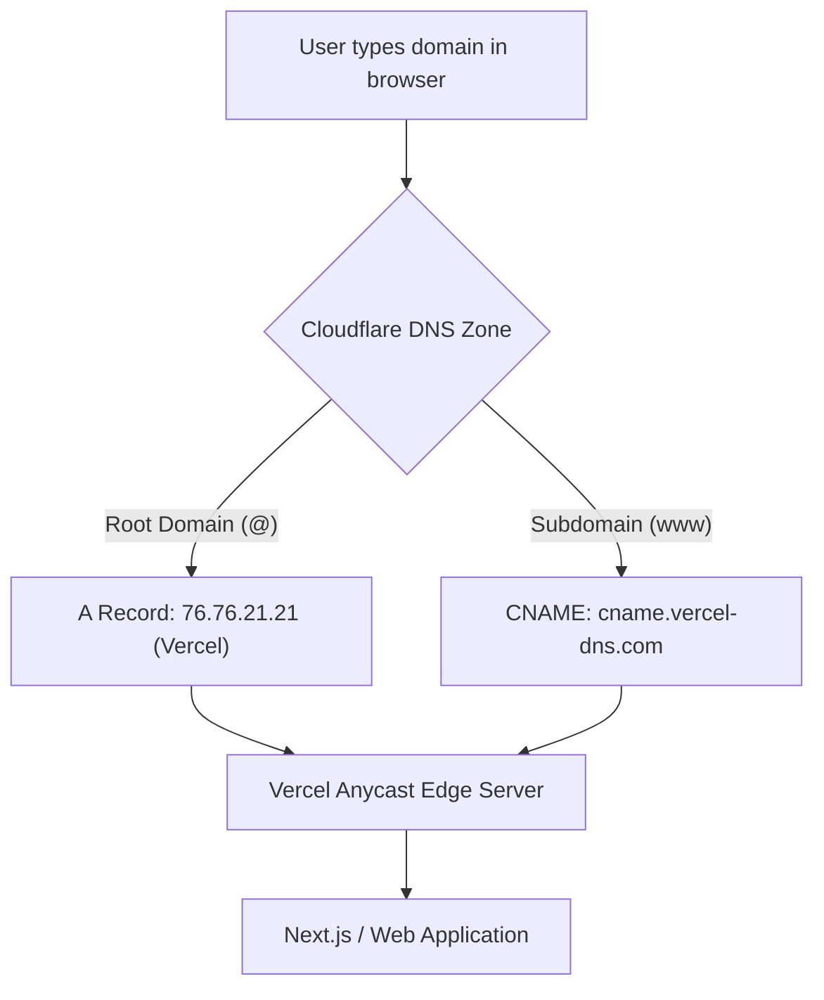

# Complete DNS & Domain Troubleshooting Guide for Web Developers

This document serves as an all-in-one reference manual for setting up, managing, and debugging Domain Name System (DNS) configurations for modern web applications hosted on platforms like **Vercel**, **Cloudflare**, **AWS**, **Netlify**, or **DigitalOcean**.

---

## Table of Contents
1. [Essential DNS Record Types](#1-essential-dns-record-types)
2. [Hosting & Domain Configuration Workflow](#2-hosting--domain-configuration-workflow)
3. [Top 6 DNS Errors, Root Causes & Fixes](#3-top-6-dns-errors-root-causes--fixes)
4. [Email DNS Configuration (SPF, DKIM, DMARC)](#4-email-dns-configuration-spf-dkim-dmarc)
5. [Terminal Diagnostic Commands & Cheatsheet](#5-terminal-diagnostic-commands--cheatsheet)
6. [Pre-Launch DNS Verification Checklist](#6-pre-launch-dns-verification-checklist)

---

## 1. Essential DNS Record Types

| Record Type | Full Name | Purpose & Function | Example Configuration |
| :--- | :--- | :--- | :--- |
| **`A`** | Address Record | Maps a hostname directly to an **IPv4 address**. Essential for root/apex domains (`@`). | `@` $\rightarrow$ `76.76.21.21` *(Vercel Apex IP)* |
| **`AAAA`** | IPv6 Address Record | Maps a hostname directly to an **IPv6 address**. | `@` $\rightarrow$ `2606:4700:3033::6815:1234` |
| **`CNAME`** | Canonical Name | Maps a hostname as an **alias to another domain name**. Cannot exist at root `@` unless using CNAME flattening. | `www` $\rightarrow$ `cname.vercel-dns.com` |
| **`MX`** | Mail Exchanger | Specifies the mail server responsible for accepting incoming emails for the domain. | `@` $\rightarrow$ `smtp.secureserver.net` (Priority: 0) |
| **`TXT`** | Text Record | Stores human/machine-readable text. Used for **domain ownership verification** & **email security**. | `@` $\rightarrow$ `"google-site-verification=xyz"` |
| **`NS`** | Name Server | Identifies the authoritative DNS servers delegated to manage the domain's DNS zone. | `ns1.cloudflare.com` / `ns2.cloudflare.com` |
| **`CAA`** | Certification Authority Authorization | Restricts which Certificate Authorities (e.g. Let's Encrypt, DigiCert) are allowed to issue SSL certificates. | `@` $\rightarrow$ `issue "letsencrypt.org"` |
| **`SRV`** | Service Record | Defines hostname and port for specific services (e.g., SIP, Office 365 Autodiscover). | `_autodiscover._tcp` $\rightarrow$ `1 443 autodiscover...` |

---

## 2. Hosting & Domain Configuration Workflow

### Standard Setup for Custom Domains (e.g., Cloudflare DNS + Vercel Hosting)

### Step-by-Step Production Checklist
1. **Registrar (GoDaddy, Namecheap, Google Domains)**:
   * Point Nameservers (`NS`) to your active DNS provider (e.g., Cloudflare nameservers `may.ns.cloudflare.com`).
2. **DNS Provider (Cloudflare)**:
   * **Apex (`@`)**: Add `A` record pointing to host IP (`76.76.21.21`). Proxy status: **DNS Only (Grey Cloud)** during setup.
   * **Subdomain (`www`)**: Add `CNAME` record pointing to host alias (`cname.vercel-dns.com`). Proxy status: **DNS Only (Grey Cloud)**.
3. **Hosting Dashboard (Vercel / Netlify / AWS)**:
   * Add both `yourdomain.com` and `www.yourdomain.com` under **Project Settings $\rightarrow$ Domains**.
   * Set preferred canonical redirect (e.g. redirect `yourdomain.com` $\rightarrow$ `www.yourdomain.com`).

---

## 3. Top 6 DNS Errors, Root Causes & Fixes

### 1. `DNS_PROBE_FINISHED_NXDOMAIN`
> **Symptom**: Browser error "This site can't be reached. Check if there is a typo in yourdomain.com".

* **Root Cause**: No `A` or `CNAME` record exists for the queried domain/subdomain, or nameservers are pointing to an inactive DNS provider.
* **Fix**:
  1. Add an **`A` record** for `@` pointing to your server IP.
  2. Run `dig +short yourdomain.com` to verify an IP is returned.

---

### 2. `ERR_TOO_MANY_REDIRECTS` (Infinite Redirect Loop)
> **Symptom**: Page fails to load with "Too many redirects".

* **Root Cause**: Cloudflare SSL/TLS mode is set to **Flexible**. Cloudflare sends unencrypted HTTP requests to the backend server, but Vercel/Next.js forces HTTPS redirects, creating a loop (`HTTP` $\rightarrow$ `HTTPS` $\rightarrow$ `Cloudflare HTTP` $\rightarrow$ `HTTPS`).
* **Fix**:
  1. Go to **Cloudflare Dashboard $\rightarrow$ SSL/TLS**.
  2. Change encryption mode from **Flexible** to **Full** or **Full (Strict)**.

---

### 3. `ERR_CERT_COMMON_NAME_INVALID` (SSL Certificate Warning)
> **Symptom**: Browser flags connection as unsafe or untrusted.

* **Root Cause**: Domain DNS is pointing to the server, but the domain has not been added inside the hosting platform's domain settings, so no SSL certificate was generated for that hostname.
* **Fix**:
  1. Add the domain to your host project settings (Vercel/Netlify).
  2. Ensure proxy status is temporarily **DNS Only (Grey Cloud)** so Let's Encrypt can complete ACME validation.

---

### 4. `www` Subdomain Works, but Root Domain `@` Fails (or Vice Versa)
> **Symptom**: `www.yourdomain.com` opens fine, but `yourdomain.com` shows `NXDOMAIN`.

* **Root Cause**: Only the `www` CNAME record was added in DNS, leaving the apex `@` domain blank.
* **Fix**: Add an `A` record for `@` pointing to `76.76.21.21` (or your host IP).

---

### 5. DNS Changes Not Reflecting (Stale Cache)
> **Symptom**: DNS updated in Cloudflare, but your computer still connects to the old server.

* **Root Cause**: Local OS DNS cache, ISP DNS cache, or browser cache is storing the old record based on the TTL (Time To Live).
* **Fix**:
  * **macOS**: `sudo dscacheutil -flushcache; sudo killall -HUP mDNSResponder`
  * **Windows**: `ipconfig /flushdns`
  * **Chrome**: Open `chrome://net-internals/#dns` and click **Clear host cache**.

---

### 6. Cloudflare Proxying Breaks WebSocket / Server-Sent Events (SSE)
> **Symptom**: Real-time connections drop or time out after 100 seconds.

* **Root Cause**: Cloudflare Orange Cloud proxy enforces a 100-second HTTP response timeout on free plans.
* **Fix**: Set the record proxy status to **DNS Only (Grey Cloud)** for real-time WebSocket endpoints or subdomains.

---

## 4. Email DNS Configuration (SPF, DKIM, DMARC)

To prevent outgoing transactional and corporate emails from being flagged as spam:

### 1. SPF (Sender Policy Framework)
Specifies which mail servers are authorized to send email on behalf of your domain.
* **Type**: `TXT`
* **Name**: `@`
* **Value**: `"v=spf1 include:secureserver.net include:_spf.google.com ~all"`

### 2. DKIM (DomainKeys Identified Mail)
Cryptographic signature verifying that email content was not altered in transit.
* **Type**: `CNAME` or `TXT` (provided by mail provider e.g., Google Workspace, Microsoft 365, SendGrid).

### 3. DMARC (Domain-based Message Authentication)
Tells receiving mail servers what action to take if SPF or DKIM checks fail.
* **Type**: `TXT`
* **Name**: `_dmarc`
* **Value**: `"v=DMARC1; p=reject; rua=mailto:dmarc_rua@yourdomain.com; adkim=r; aspf=r;"`

---

## 5. Terminal Diagnostic Commands & Cheatsheet

### Command Reference Table

| Diagnostic Action | Terminal Command |
| :--- | :--- |
| **Check IPv4 resolution** | `dig yourdomain.com A` |
| **Quick IP check (short format)** | `dig yourdomain.com A +short` |
| **Query specific DNS resolver** | `dig @1.1.1.1 yourdomain.com A` *(Bypasses local cache)* |
| **Check CNAME record** | `dig yourdomain.com CNAME +short` |
| **Check MX records** | `dig yourdomain.com MX +short` |
| **Trace full DNS delegation** | `dig yourdomain.com +trace` |
| **Test HTTP headers & redirects** | `curl -ILs https://yourdomain.com \| head -n 20` |
| **Flush macOS DNS cache** | `sudo dscacheutil -flushcache; sudo killall -HUP mDNSResponder` |

---

## 6. Pre-Launch DNS Verification Checklist

- [ ] **Apex `A` Record**: `@` points to host IPv4 (`76.76.21.21` for Vercel).
- [ ] **Subdomain `CNAME` Record**: `www` points to host alias (`cname.vercel-dns.com`).
- [ ] **Hosting Dashboard**: Both `@` and `www` added and validated with green SSL checks.
- [ ] **SSL Mode**: Cloudflare set to **Full (Strict)** if proxying is enabled.
- [ ] **Email Records**: `MX`, `SPF`, `DKIM`, and `DMARC` records intact.
- [ ] **Global Propagation**: Verified resolution across regions on [DNSChecker.org](https://dnschecker.org).
